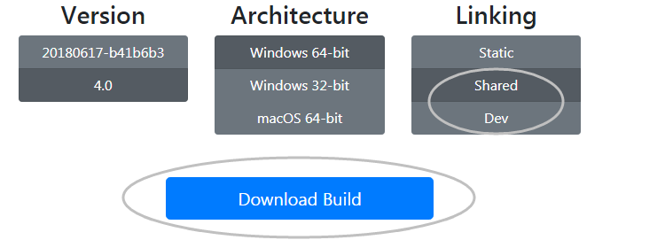
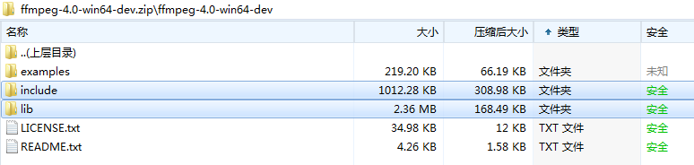
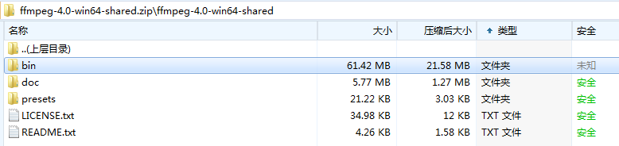
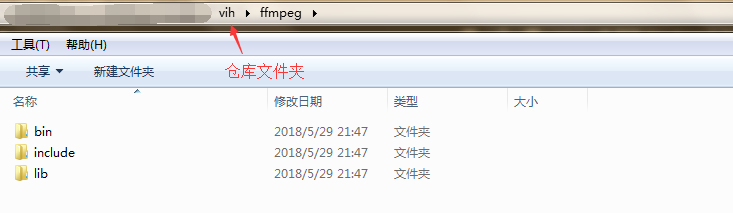
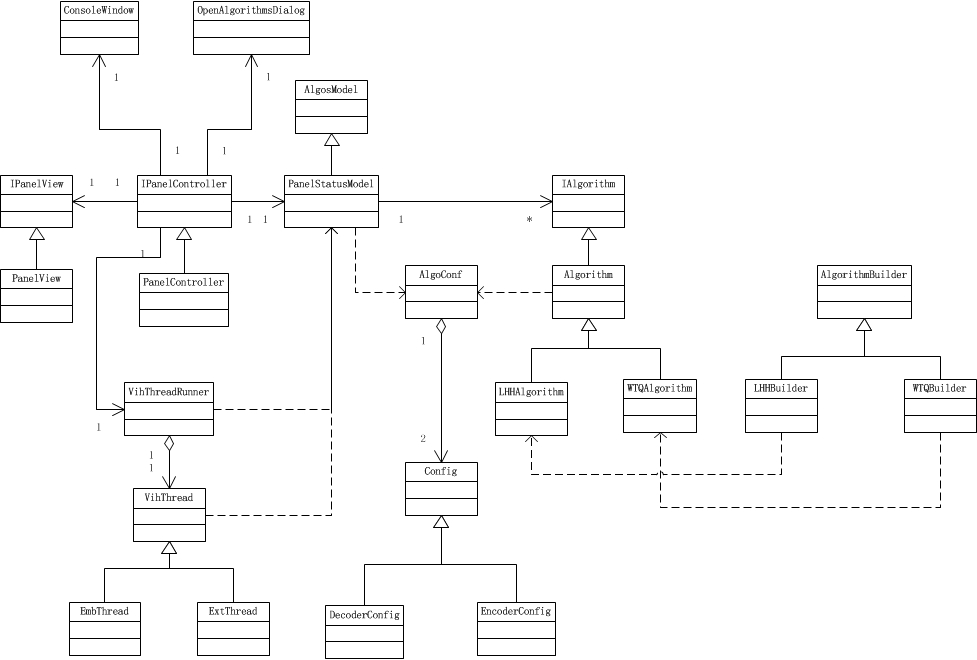
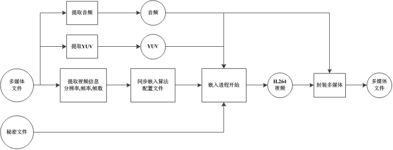
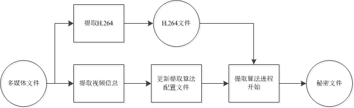

# 开发文档

## 一、开发环境
* Windows 64bit
* Visual Studio 2013

### 1.*Qt 5.8*
引用Qt官网的介绍：
>Easily create connected devices, UIs and applications with native C++ performance. It’s powerful, yet compact, has intuitive tools and libraries and will blow your mind!

Qt编写的工程是无法直接通过C++直接编译的，需要通过Qt进行预编译。Qt Creater是一款轻量级的Qt-IDE，对Qt的预编译支持非常好，但是由于Qt Creater的调试效率不及Visual Studio，因此为了让Visual Studio支持Qt预编译及其他Qt功能，需要在Visual Studio上安装Qt插件。

对于Visual Studio上进行Qt的编译，请参考这篇[博文](https://blog.csdn.net/goodtomsheng/article/details/45719205)。需要注意的是该博文采用的是Qt5.4,建议安装`Qt5.8`。
### 2.*FFmpeg 4.0*
FFmpeg是一款基于C/C++的跨平台的多媒体处理方案，提供了用于C/C++开发多媒体的第三方组件库。当前产品采用了FFmpeg读取多媒体数据信息，提取音视频文件、封装多媒体文件等。
#### 1).下载
在[这里](https://ffmpeg.zeranoe.com/builds/)进入FFmpeg的下载页，并且选择[4.0-Win64-Shared]和[4.0-Win64-Dev]两款进行下载。



将Dev版本中的include文件夹和lib文件夹移动到本仓库的ffmpeg文件夹(若该文件夹不存在，请`新建ffmpeg文件夹`)下。



将Shared版本的bin文件夹移动到本仓库的ffmpeg文件夹下。



最终的ffmpeg文件夹如下图所示：



#### 2).配置与使用
##### a.头文件
工程[属性]->[配置属性]->[C/C++]->[常规]的`附加包含目录`中添加ffmpeg的include文件夹。
##### b.静态库
工程[属性]->[配置属性]->[链接器]->[常规]的`附加库目录`中添加ffmpeg的lib文件夹。

工程[属性]->[配置属性]->[链接器]->[输入]的`附加依赖项`中添加ffmpeg的lib文件：
```
avcodec.lib
avdevice.lib
avfilter.lib
avformat.lib
avutil.lib
postproc.lib
swresample.lib
swscale.lib
```
##### c.动态库
系统环境变量PATH中直接添加动态库目录`ffmpeg/bin`
### 3.*K-Lite Codec Pack*
Qt界面在进行视频播放的时候，需要选择视频解码器，当前产品采用`K-Lite`作为视频播放的解码器。点击[这里](http://www.codecguide.com/download_k-lite_codec_pack_standard.htm)，进入K-Lite的下载页面，请下载并安装。


## 二、UML


## 三、机制详解
### 1.*信息隐藏和提取框架*
信息嵌入过程框图如下图所示：



信息提取过程框图如下图所示：



### 2.*MVC架构*
### 3.*算法单元*
`算法单元对象`代指了一个信息隐藏/提取算法，本系统的信息隐藏算法的执行都是调用可执行文件完成的，因此算法单元对象最重要的就是需要映射到可执行文件，并且需要告诉用户如何给与可执行文件需要的参数。在UML图中，IAlgorithm、Algorithm、LHHAlgorithm、WTQAlgorithm组成了算法单元，而右侧的AlgorithmBuilder类则是对用于构建算法单元的。
#### 1).类IAlgorithm
这个类用来提供一目了然的接口，给用户指出了算法单元所具备的能力，也是算法单元类的最高抽象：
```cpp
class IAlgorithm {
public:
virtual const QString algo_name() = 0;      // 获得算法的名字
virtual const QString workspace() = 0;      // 获得算法工作路径
virtual const QString encoder_path() = 0;   // 获得算法编码器路径
virtual const QString decoder_path() = 0;   // 获得算法解码器路径
// 获得输入参数的mapper
virtual const QHash<QString, QString> &param_map(OperaType type) = 0;
// 添加环境变量kv对
virtual void add_param(OperaType type, const QString &key, const QString& val) = 0;
// 删除环境变量kv对
virtual void del_param(OperaType type, const QString &key) = 0;
// 清空变量变量
virtual void clear_param(OperaType type) = 0;

// 默认参数加载方案，配置命令所需要的args和环境变量env
virtual void load_env_args(OperaType type, QStringList &env, QStringList &args);
};
```
很明显，算法单元对象可以获得算法的可执行程序路径，以及算法进程的工作路径，也可以设置算法进程的环境变量，环境变量用于给算法传参。同时算法单元文件给了`load_env_args()`接口，该接口的调用会返回可执行文件在执行时需要传入的参数列表`args`，以及需要初始化的环境变量`env`。`load_env_args()`接口的默认实现是获得JM编解码的参数列表。
#### 2).类Algorithm
类Algorithm用于实现IAlgorithm的所有接口，`load_env_args()`接口仍然采用默认实现，这是因为参数列表和初始环境变量都需要由更加具体的子类来指定。
#### 3).子类Algorithm
`LHHAlgorithm`和`WTQAlgorithm`都是子类Algorithm，主要作用是提供可执行程序的参数列表以及进程初始环境变量，这是为了避免不同的算法所提供的参数方式不同，而由子类Algorithm进行决定，提供了最大程度的灵活性。建议秘密文件由参数列表提供，其他参数由环境变量提供。
#### 4).使用
算法单元对象存在`类AlgosModel`中：
```cpp
class AlgosModel{
public:
    void add_algorithm(std::shared_ptr<IAlgorithm> algorithm);
protected:
    QList<std::shared_ptr<IAlgorithm>> __algos__;
    int __algoIdx__;
};
```
在主函数的MVC初始化中，通过调用AlgosModel::add_algorithm来将算法添加到模型中，变量`__algoIdx__`代表了视频信息隐藏系统当前所选择算法的索引。
### 4.*算法调用*
算法的调用结合了Qt的多线程和多进程功能，在UML图中由VihThreadRunner、VihThread、ExtThread、EmbThread来实现算法调用的功能。
#### 1).VihThread
这是一个视频信息隐藏线程，提供了发送线程信号的接口、进行线程安全停止的接口以及算法进程处理过程中的异常处理方案。线程的信号是发送给VihThreadRunner对象的。
#### 2).VihThreadRunner
这是用于管理视频信息隐藏线程启动和结束的类，VihThreadRunner由`类PanelStatusModel`管理，并且保证一次只允许一个`VihThread`。在视频信息隐藏系统点击`嵌入按钮`后，将会提交一个`VihThread对象`给VihThreadRunner运行，VihThreadRunner将会接收这个VihThread的信号，并把信号转发给`PanelStatusModel`。当调用其`stop()`接口，VihThreadRunner无论线程是否停止，都将会立即通知`PanelStatusModel`其线程已经停止，可以开始下一个VihThread。
#### 3).EmbThread
这个是嵌入线程，在开始信息隐藏时，由`PanelStatusModel`创建该对象，并将EmbThread交给VihThreadRunner管理和运行。在EmbThread中，将会启动信息隐藏进程，并等待隐藏进程的结束。
#### 4).ExtThread
类似EmbThread。
### 5.*配置文件*
### 6.*动态加载*

## 四、NEXT
* 1.提供对avi/rmvb/...更多种类视频的支持
* 2.生成视频H.264分辨率的YUV(宽高均为16的倍数)。
* 3.添加media播放的进度条。
* 4.解决提取的YUV文件不能进行正常的JM编码。
* 5.添加性能指标
* 6.media转yuv掉首帧问题